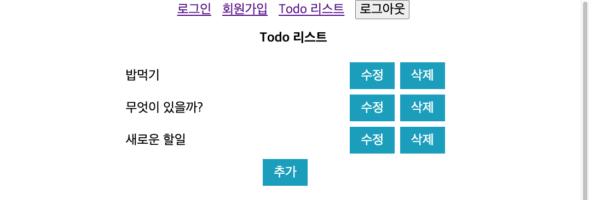
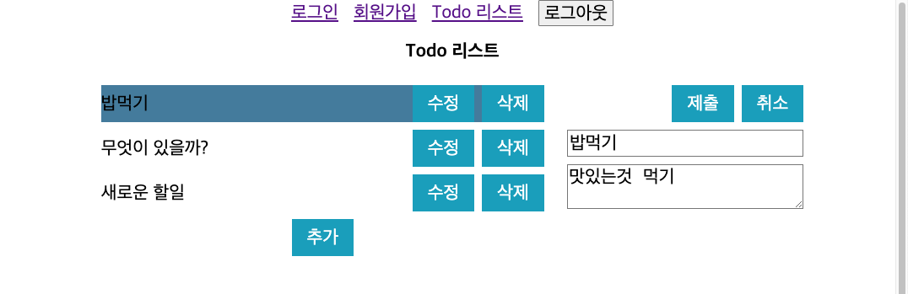

# 🚀 원티드 2023-01 프론트엔드 프리온보딩 챌린지

<p align="center">
  
</p>

<br/>

## 패키지 설치 및 실행

패키지 설치

```cmd
yarn install
```

실행(개발모드)

```cmd
yarn dev
```

- `.env.dev`, `.env` 파일에 환경변수에 따라 backend의 주소(api baseURL)와 접속주소의 포트가 달라집니다.
  
  ```.env
  # .env.dev
  
  # backend로 설정된 주소
  SERVER_BASE_URL=localhost:8080

  # 포트
  PORT=8079
  ```

<br/>

## 폴더 구조

```txt
public
\_ 정적인 파일들(index.html, 이미지, 폰트 등)이 모인 폴더
src
\_api : api관련 함수가 있는 폴더
\_components : React component가 있는 폴더
\_constants : 상수들이 모여 있는 폴더
\_pages : 페이지들이 모여 있는 폴더
\_styles : 스타일 관련한 것들이 모여 있는 폴더
\_utils : 유틸리티들이 모여 있는 폴더
\_App.tsx
\_index.tsx
```

<br/>

## 회원가입 페이지

<p align="center">
  
</p>

- 입력한 이메일과 비밀번호가 설정된 양식에 맞지 않는 경우 오류 메시지가 나옵니다.
  - 이메일: 최소 `@`, `.` 포함
  - 비밀번호: 8자 이상 입력

<br/>

## Todo 리스트 페이지

<p align="center">
  
</p>

<p align="center">
  
</p>

- 삭제시 `alert()`로 사용자에게 삭제 여부를 한번 더 확인합니다.
- **미완 목록**
  - 수정중인 title이 todo-list에 반영
